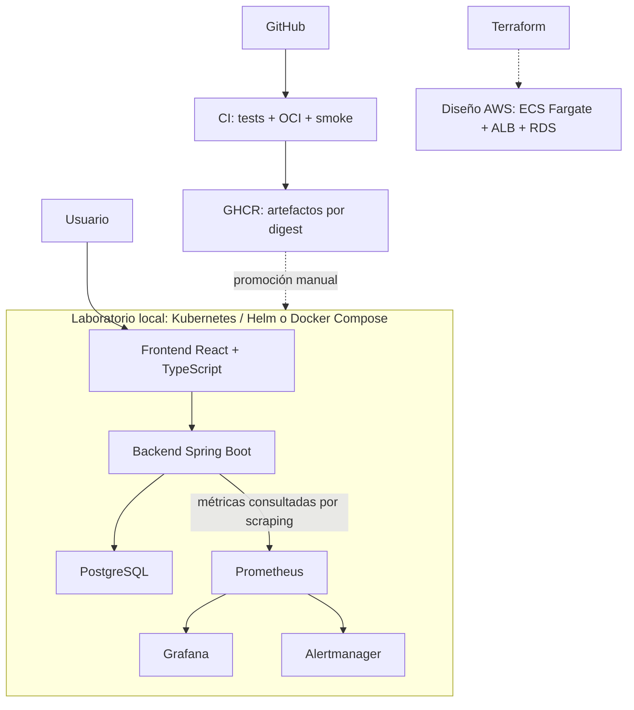

# StockFlow

Aplicación web de inventario y ventas para pequeños comercios. Proyecto personal de portfolio enfocado en consistencia de datos, confiabilidad y entrega verificable.

Permite administrar **categorías y productos**, registrar **entradas/salidas de inventario**, confirmar ventas con descuento de **stock**, consultar historial y un **dashboard diario**. Incluye autenticación de administrador con BCrypt/JWT para instalaciones privadas.


Captura real anterior al historial de ventas. Recorrido de cinco minutos: [guion de demostración](docs/portfolio/Guion%20de%20demostracion.md).

## Qué demuestra

| Área | Evidencia |
| --- | --- |
| Backend Engineering / Databases | Monolito modular Java 21 + Spring Boot, PostgreSQL 17/Flyway, transacciones, concurrencia e idempotencia persistente. |
| Testing | Unitarias, MVC, integración con PostgreSQL real y recorridos React/TypeScript en Chromium. |
| Reliability / Observability | Probes, graceful shutdown, logs JSON/request ID, Micrometer, dashboards, SLI/SLO, error budget y alertas. |
| Containers / Kubernetes / Platform Engineering | Compose reproducible, dos réplicas en kind, persistencia y Chart Helm con experimentos de recuperación. |
| CI / Supply Chain | GitHub Actions valida y publica OCI en GHCR con SBOM/provenance y promoción por digest. |
| Infrastructure as Code / Cloud Architecture | Terraform validado estáticamente, ADR ECS/EKS/EC2 y costos AWS evaluados; sin recursos AWS provisionados. |

## Arquitectura



Las flechas discontinuas representan promoción manual y diseño sin provisionar. Kind tiene un nodo y PostgreSQL único; sus límites están documentados. [Arquitectura técnica](docs/ARCHITECTURE.md).

## Quick start

Requisitos: Docker con Compose; Internet para el primer build.

```bash
git clone https://github.com/JulianAscenzi/StockFlow.git
cd StockFlow
cp .env.example .env
```

Editá `.env`: reemplazá `POSTGRES_PASSWORD`, `APP_ADMIN_PASSWORD`, `APP_JWT_SECRET` y `GRAFANA_ADMIN_PASSWORD`. Generá **cada valor por separado** con `openssl rand -hex 32`; el JWT requiere al menos 32 caracteres. Conservá `APP_AUTH_ENABLED=true`.

```bash
docker compose up --build
```

Abrí **http://localhost:5173** e ingresá con `APP_ADMIN_EMAIL` y tu contraseña. Creá categoría/producto → entrada de stock → venta → resumen. Grafana: http://localhost:3000. Para detener conservando datos: `docker compose down`.

Configuración, puertos, desarrollo Maven/Vite y troubleshooting: [guía local](docs/LOCAL_DEVELOPMENT.md). La [demo Vercel/Render](docs/DEPLOYMENT.md) usa datos ficticios y depende de servicios gratuitos; no es necesaria para evaluar el repositorio.

## Tests

**385 tests backend y 28 escenarios Playwright** en la última evidencia registrada: [STATUS](docs/STATUS.md). Cubren dominio, servicios, contratos HTTP, migraciones/repositorios PostgreSQL, rollback, concurrencia, idempotencia y flujos de navegador. Son checkpoints, no resultados nuevos de este cierre documental.

```bash
(cd backend && ./mvnw test)
npm --prefix frontend ci
npm --prefix frontend exec -- playwright install --with-deps chromium
npm --prefix frontend run test:e2e
```

Navegador usa backend y PostgreSQL aislados. [Detalles de ejecución](docs/LOCAL_DEVELOPMENT.md#pruebas-de-navegador-aisladas).

## Engineering highlights

- Venta, stock, movimientos y clave idempotente confirman o revierten en una transacción.
- Bloqueos pesimistas en orden de producto y refresh bajo lock evitan sobreventa y lecturas JPA obsoletas.
- UUID + fingerprint persistidos recuperan una venta sin repetir descuentos; snapshots preservan su historia.
- Liveness separada de readiness evita reiniciar JVM sanas cuando cae PostgreSQL.
- Métricas de éxito después del commit, con etiquetas acotadas; PostgreSQL conserva la verdad comercial.
- SLOs con cobertura explícita, error budget y alertas burn-rate de dos ventanas.
- CI promueve el mismo OCI probado, sin rebuild; Helm despliega por digest con SBOM/provenance asociados.

## Reliability experiments

Muestras locales ejecutadas el 2026-10-03, conservadas en [Kubernetes](docs/KUBERNETES.md#resultados-medidos-2026-10-03) y [STATUS](docs/STATUS.md); no son garantías de rendimiento.

| Experimento | Resultado observado |
| --- | --- |
| Self-healing | Pod eliminado y reemplazado en 26,59 s; 121 lecturas HTTP 200. |
| PostgreSQL outage | Liveness UP, readiness DOWN, scraper UP; Compose respondió 503 de infraestructura y recuperó sin reiniciar JVM. Kubernetes retiró endpoints sin reiniciar backend. |
| Graceful shutdown | Request bloqueada terminó 200; cierre HTTP/JPA/Hikari, salida 143 por SIGTERM, sin SIGKILL. |
| Rolling deployment / rollback | 232 / 237 lecturas respectivamente, todas HTTP 200. |
| Liveness failure | JVM suspendida; kubelet reinició la réplica, restartCount 0→1; recuperación en 49,33 s. |

SLI/SLO provisionales, error budget y burn-rate alerts: [SRE](docs/SRE.md). Diagnóstico: [runbooks](docs/RUNBOOK.md). Operación y empaquetado: [OPERATIONS](docs/OPERATIONS.md), [Helm](docs/HELM.md).

## CI / Supply chain

`commit → tests → OCI → smoke → GHCR → digest`

Sólo main/tags estables publican después de todas las validaciones. El OCI lleva tags SHA, SBOM SPDX y provenance SLSA v1; CI verifica el digest remoto. Publicación y consumo anónimo desde kind registrados. Attestations no equivalen a firma independiente ni certificación SLSA. [Contrato y límites](docs/CONTAINER_REGISTRY.md).

## Cloud / Terraform

Arquitectura AWS diseñada y Terraform implementado, con validación estática y siete tests mock. **Sin despliegue AWS ni provisionamiento permanente**, deliberadamente para evitar costos cloud innecesarios. Comparación ECS/EKS/EC2 y elección ECS Fargate + ALB + RDS documentadas; las pruebas no acreditan operación cloud.

[ADR](docs/adr/0001-cloud-runtime.md) · [Terraform](terraform/README.md) · [Costos y supuestos](docs/AWS_COSTS.md).

## Explorar el portfolio

[Mapa documental](docs/Inicio.md) · [CV, LinkedIn y entrevista](docs/PORTFOLIO.md) · [Capturas pendientes](docs/images/README.md) · [Roadmap completado y mejoras opcionales](docs/ROADMAP.md) · [Borrador v1.0.0](docs/RELEASE_NOTES_1.0.0.md).

Licencia [MIT](LICENSE).
