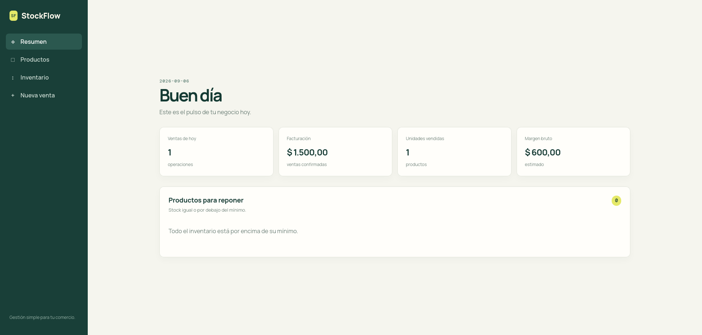

# StockFlow

StockFlow es una aplicación web de inventario y ventas para pequeños comercios. Permite administrar categorías y productos, registrar entradas o salidas de stock y confirmar ventas. El resumen muestra las métricas del día en la zona horaria de Argentina.

## Demo pública

- [Abrir la aplicación](https://frontend-beta-plum-15.vercel.app/)
- [Estado de la API](https://stockflow-api-0fan.onrender.com/actuator/health)

La demo usa datos ficticios y está publicada con servicios gratuitos. La API puede tardar aproximadamente un minuto en responder después de un período de inactividad.



## Decisiones técnicas destacadas

- PostgreSQL y Flyway son la fuente de verdad del esquema; Hibernate valida, no genera tablas en ejecución.
- Las ventas conservan snapshots de nombre, SKU, precio y costo, para que el historial no cambie al editar el catálogo.
- Las salidas de inventario usan bloqueo pesimista y cada variación registra su movimiento histórico en la misma transacción.
- Las líneas de una venta se bloquean por ID en orden determinista para reducir conflictos entre ventas concurrentes.
- La suite de integración usa PostgreSQL real mediante Testcontainers; no depende de una base H2 distinta del entorno operativo.

## Recorrido de evaluación (1 minuto)

1. Abrí la demo y entrá a **Productos**. Creá una categoría y un producto con precio, costo y stock mínimo.
2. En **Inventario**, registrá una entrada para ese producto.
3. En **Nueva venta**, agregalo, elegí una cantidad y confirmá. Mientras la operación está en curso, los controles quedan bloqueados para evitar un doble envío.
4. Volvé a **Resumen**: se reflejan la venta, facturación, unidades, margen bruto estimado y, si corresponde, el aviso de stock bajo.

El catálogo de productos se navega por páginas y los selectores de categorías y productos activos cargan todas sus páginas, por lo que el flujo sigue disponible aunque haya más de 100 registros.

## Requisitos

Para el entorno completo: Docker con Docker Compose y conexión a Internet en el primer build.
Para ejecutar procesos fuera de Docker: Java 21 y Node 24+ con npm.

## Arranque local con Docker Compose

Desde la raíz, prepará una sola vez la configuración:

```bash
cp .env.example .env
```

Configurá `GRAFANA_ADMIN_PASSWORD` y reemplazá las contraseñas y el secreto JWT de ejemplo por valores propios locales; el JWT requiere al menos 32 caracteres. `.env` está ignorado y no se copia a las imágenes. Si ya tenés un `.env`, agregá las variables faltantes sin sobrescribirlo.

Levantá toda la aplicación:

```bash
docker compose up --build
```

Abrí `http://localhost:5173` e ingresá con `APP_ADMIN_EMAIL` y `APP_ADMIN_PASSWORD`. PostgreSQL debe estar healthy antes de iniciar la API, y la API antes de iniciar Vite. Flyway aplica o valida V1–V5; Hibernate valida el esquema. Para segundo plano: `docker compose up --build -d --wait`.

```text
Navegador → localhost:5173 → frontend (Vite)
                              /api → backend:8080 → database:5432
```

Compose publica `127.0.0.1:5173` (interfaz), `127.0.0.1:5432` (PostgreSQL, para conservar el desarrollo con Maven), `127.0.0.1:9090` (Prometheus) y `127.0.0.1:3000` (Grafana). La API permanece en la red interna. El navegador usa rutas relativas `/api`; Vite resuelve `backend` dentro de Docker. No hace falta CORS entre la interfaz y su proxy. El healthcheck del backend consulta su listener de management en la red interna; los demás usan loopback dentro de cada contenedor.

El frontend es un contenedor local con Vite, dependencias instaladas mediante `npm ci` y código copiado en el build. Después de editar fuentes, repetí `docker compose up --build`; no hay bind mounts ni hot reload desde el host. No es una imagen de producción: en Vercel se siguen sirviendo archivos estáticos de `npm run build`.

Verificación operativa:

```bash
docker compose config --quiet
docker compose ps
docker compose exec backend curl --fail http://backend-management:9091/actuator/health
docker compose logs backend
```

`docker compose config` sin `--quiet` muestra valores resueltos, incluidos secretos; no publiques su salida. Cambiar `POSTGRES_PASSWORD` en `.env` no cambia la contraseña de una base ya inicializada. Tampoco cambiar `APP_ADMIN_PASSWORD` modifica un administrador existente: esas credenciales se usan en el primer arranque.

## Desarrollo con Maven y Vite fuera de Docker

Primero detené el entorno completo si está iniciado (`docker compose down`, sin `-v`). Con el mismo `.env`:

1. Iniciá PostgreSQL y esperá a que el servicio quede saludable.

   ```bash
   docker compose up -d database
   docker compose ps
   ```

2. En una terminal, cargá las variables de `.env` e iniciá el backend. Flyway aplicará las migraciones automáticamente; Hibernate sólo valida el esquema.

   ```bash
   set -a; . ./.env; set +a
   cd backend
   ./mvnw spring-boot:run
   ```

   El backend queda disponible en `http://localhost:8080`.

3. En otra terminal, instalá las dependencias e iniciá la interfaz.

   ```bash
   cd frontend
   npm ci
   VITE_AUTH_ENABLED=true npm run dev
   ```

   Abrí `http://localhost:5173`. Durante el desarrollo, Vite redirige las solicitudes `/api` al backend local.

## Primer uso

1. En **Productos**, creá una categoría.
2. Creá un producto y definí su precio, costo y stock mínimo.
3. En **Inventario**, registrá una entrada de stock.
4. En **Nueva venta**, agregá el producto y confirmá la venta.
5. Volvé al **Resumen** para consultar ventas, facturación, margen bruto estimado y productos a reponer.

Las ventas y movimientos de stock quedan registrados como historial. Una venta descuenta el stock en la misma operación.

## API en breve

Todas las rutas devuelven DTOs JSON; las rutas de catálogo paginadas incluyen `content`, `page`, `size`, `totalElements` y `totalPages`.

| Operación | Ruta | Ejemplo mínimo |
| --- | --- | --- |
| Consultar resumen diario | `GET /api/dashboard` | `GET /api/dashboard?size=8` |
| Listar productos | `GET /api/products` | `GET /api/products?page=0&size=20` |
| Registrar entrada | `POST /api/products/{id}/stock/in` | `{"quantity": 10, "reason": "Recepción"}` |
| Confirmar venta | `POST /api/sales` | `{"items":[{"productId":1,"quantity":2}]}` |

Con autenticación habilitada, las rutas de negocio requieren `Authorization: Bearer <token>` y el token se obtiene con `POST /api/auth/login`. La demo pública la desactiva intencionalmente.

## Verificación

Para compilar la interfaz:

```bash
cd frontend
npm run build
```

Para ejecutar la suite del backend con PostgreSQL real mediante Testcontainers:

```bash
cd backend
./mvnw test
```

Docker debe estar disponible para las pruebas de integración. Para una comprobación manual, confirmá que `GET http://localhost:8080/api/dashboard` responde JSON y que la interfaz carga su resumen sin avisos de error.

## Configuración

Las probes, logs, request ID, timeouts y el comportamiento ante una caída de PostgreSQL se documentan en [Operación del backend](docs/OPERATIONS.md).

| Variable | Uso local |
| --- | --- |
| `POSTGRES_DB`, `POSTGRES_USER`, `POSTGRES_PASSWORD` | Base y credenciales, obligatorias |
| `POSTGRES_PORT` | Puerto PostgreSQL del host; por defecto 5432 |
| `FRONTEND_PORT` | Puerto de interfaz en Compose; por defecto 5173 |
| `APP_AUTH_ENABLED` | Autenticación y login en Compose; por defecto true |
| `APP_ADMIN_EMAIL`, `APP_ADMIN_PASSWORD` | Administrador inicial |
| `APP_JWT_SECRET` | Firma JWT, al menos 32 caracteres |

Compose fija `POSTGRES_HOST=database`, el puerto interno de PostgreSQL en 5432 y `PORT=8080`; el puerto publicado del host no altera esos valores. En Maven el host sigue siendo localhost por defecto. No se carga todo `.env` en los contenedores: sólo las variables declaradas.

Compose fija `VITE_API_BASE_URL` vacío y `VITE_API_PROXY_TARGET=http://backend:8080`; deriva `VITE_AUTH_ENABLED` de `APP_AUTH_ENABLED`. Ninguna variable `VITE_*` contiene secretos. La ejecución manual de Vite con autenticación requiere `VITE_AUTH_ENABLED=true npm run dev`. Render conserva `DATABASE_URL` y Vercel conserva `VITE_API_BASE_URL`/`VITE_AUTH_ENABLED`; sus configuraciones no cambian. La primera ejecución crea un único administrador con email y contraseña hasheada con BCrypt. Cambiá las contraseñas y el secreto antes de usar una base fuera de tu equipo y nunca publiques `.env`.

El proxy de Vite usa `http://localhost:8080` por defecto. Para apuntar temporalmente a otra instancia local, por ejemplo en una prueba aislada, ejecutá:

```bash
cd frontend
VITE_API_PROXY_TARGET=http://127.0.0.1:8081 npm run dev
```

## Detener el entorno

Para detener los servicios sin borrar los datos locales:

```bash
docker compose down
```

No ejecutes `docker compose down -v` salvo que quieras eliminar deliberadamente el volumen de PostgreSQL y todos sus datos.

## Despliegue

Para una demo gratuita de portfolio se usa Vercel (interfaz) y Render Free (API y PostgreSQL). Consultá la [guía de despliegue](docs/DEPLOYMENT.md). No cargues datos reales: Render Free suspende la API inactiva y elimina la base después de 30 días. La demo pública deja la autenticación desactivada intencionalmente; para un uso comercial debe habilitarse con secretos propios.

### Pruebas de navegador aisladas

Requieren Java 21, Node 24+, npm y Docker accesible. Desde la raíz:

```bash
npm --prefix frontend ci
npm --prefix frontend exec -- playwright install chromium
npm --prefix frontend run test:e2e
```

El comando público invoca Maven y `BrowserE2EIT`, que crea PostgreSQL 17 y Spring Boot en un puerto aleatorio con credenciales exclusivas de pruebas. Playwright inicia Vite en otro puerto libre, con proxy a ese backend. No se reutilizan la demo ni servicios locales. El script interno `test:e2e:browser` requiere el entorno provisto por Java. Chromium usa un worker y cero reintentos; una suite vacía, omitida, fallida o sin informe falla la ejecución. Los diagnósticos quedan en `backend/target/browser-e2e.log` y `frontend/test-results/` (trazas y capturas de los fallos).

CI ejecuta backend y compilación frontend en paralelo; navegador requiere ambos aprobados. Se activa en pull requests, push a main y manualmente, sin desplegar. Los informes se conservan siete días. Referencias de configuración: [servidor de Playwright](https://playwright.dev/docs/test-webserver), [setup-java](https://github.com/actions/setup-java), [setup-node](https://github.com/actions/setup-node) y [artefactos](https://github.com/actions/upload-artifact).

## Observabilidad local

Compose también inicia Prometheus y Grafana. Configurar `GRAFANA_ADMIN_PASSWORD` propia en `.env` antes de `docker compose up --build`. Prometheus: http://localhost:9090; Grafana: http://localhost:3000, usuario `GRAFANA_ADMIN_USER` (por defecto admin). Datasource y dashboard StockFlow se provisionan automáticamente. Puertos sólo en loopback; API y management quedan internos. Métricas, seguridad, percentiles y persistencia: [OBSERVABILITY](docs/OBSERVABILITY.md).

La Etapa 4 añade **StockFlow - SRE Overview** y Alertmanager local en http://localhost:9093, sin notificaciones externas. No requiere nuevas credenciales. Definiciones y validación: [SRE](docs/SRE.md); procedimientos: [RUNBOOK](docs/RUNBOOK.md).

## Kubernetes local

La Etapa 5 usa kind y manifiestos simples en `k8s/`, con dos réplicas backend, PostgreSQL persistente y observabilidad. Guía de despliegue, acceso y experimentos: [docs/KUBERNETES.md](docs/KUBERNETES.md). Compose y la demo pública conservan su ejecución.
